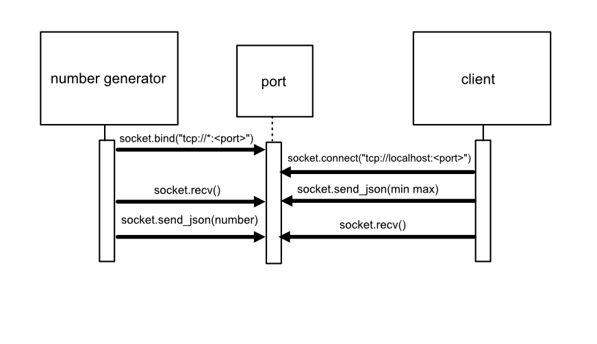

# COMMUNICATION CONTRACT

## Request number


1) Create a REQUEST socket

````
import zmq

context = zmq.Context()
socket = context.socket(zmq.REQ)
````

2) Connect to port 5555 to talk to number generator

````
socket.connect("tcp://localhost:5555")

````

4) Send min/max JSON to number generator through the socket


````
socket.send_json({"min" :1, "max":20})

````

## Get number

5) Get reply from number generator (in bytes)


````
reply = socket.recv()

````

6) Convert bytes to JSON


````
import json
number = json.loads(reply)


````




