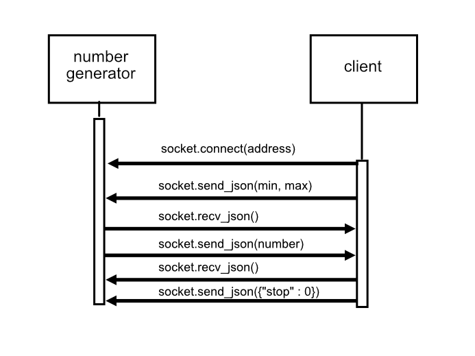

# COMMUNICATION CONTRACT

This microservice generates a random integer between a given min/max value. The service runs continuously until it receives a stop message.

## Request number


1) Create a REQUEST socket

````
import zmq

context = zmq.Context()
socket = context.socket(zmq.REQ)
````

2) Connect to "tcp://localhost:#" to talk to number generator. Replace '#' with a number of your choice.

````
socket.connect("tcp://localhost:5555")

````

4) Send min/max values in JSON format through the socket.


````
socket.send_json( {"min" : 1, "max" : 20} )

````

## Get number

5) Get reply from number generator as JSON. The reply will be in the form ``{"num" : <int>}``.


````
reply = socket.recv_json()  

````

6) Access the number with the "num" dictionary key.

````
number = reply["num"]
````


## Stop program

Stop the program by sending ``{"stop" : <any value>}``. The value of "stop" doesn't matter because the program only checks if the "stop" key exists in the JSON.
  
You can also request and stop the service in one message by adding the key "stop" to your JSON request:

``socket.send_json({"min" : 0, "max" : 4, "stop" : 0})``

## Full client code

````
import zmq


#  connect to server
context = zmq.Context()
socket = context.socket(zmq.REQ)
socket.connect("tcp://localhost:5555")

# send and receive message
socket.send_json({"min" : 1, "max" : 20})
message = socket.recv_json()

# stop the program
socket.send_json({"stop" : 0})

````

## UML diagram




